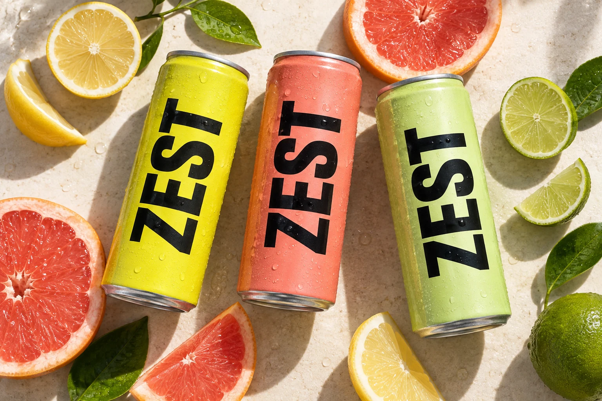

# ZEST — лендинг лимонадов с интерактивной 3D-сценой

Сайт для вымышленного бренда цитрусовых напитков. На первом экране можно вращать банку и менять вкус, а в каталоге — собрать собственный набор из шести напитков.

Проект сделан на HTML, CSS и JavaScript. За объёмную сцену отвечает Three.js.




## Возможности

- Три вкуса: юдзу и лимон, розовый грейпфрут, лайм и мята.
- Объёмная банка с материалом алюминия, каплями и этикеткой.
- Вращение мышью, касанием и с клавиатуры.
- Дольки цитрусов, которые меняются вместе со вкусом.
- Конструктор набора на шесть банок с подсчётом стоимости.
- Готовый сбалансированный набор, очистка и сохранение выбора в текстовый файл.
- Восстановление набора после перезагрузки страницы.
- Мобильное меню, управление анимацией и статичная замена при недоступном WebGL.

Набор сохраняется в браузере. Сайт не отправляет заказ и не принимает оплату; цены и бренд используются для демонстрации.

## Локальный запуск

Нужен Node.js 18 или новее. Установка пакетов и сборка не требуются.

```bash
node server.mjs
```

Откройте `http://localhost:4173`. Для публикации на статическом хостинге используется папка `dist/`.

## Структура

| Файл | Назначение |
| --- | --- |
| `dist/index.html` | Страница и окно выбора набора |
| `dist/styles.css`, `dist/details.css` | Оформление и адаптация |
| `dist/app.js` | Навигация, вкусы и конструктор |
| `dist/scene.js` | Банка, материалы и отрисовка |
| `dist/citrus.js` | Геометрия и движение цитрусов |
| `dist/data.js` | Вкусы и демонстрационные цены |
| `dist/assets/` | Изображения, шрифты и значок сайта |
| `dist/vendor/` | Локальная копия Three.js и лицензия |
| `server.mjs` | Сервер для локального просмотра |

## Оформление и материалы

В основе — жёлтый, тёмно-зелёный и светлый фон, крупные заголовки и фотографии напитков. Банка и дольки построены средствами Three.js; изображения для каталога подготовлены из той же модели.

Three.js 0.180.0 распространяется по лицензии MIT, шрифты Golos Text и Roboto Condensed — по SIL Open Font License. Фотографии и текстуры созданы с помощью OpenAI ImageGen. Все рабочие ресурсы хранятся локально.

Подробнее: [оформление](DESIGN.md) и [происхождение изображений](ASSETS.md).

## Проверки и ограничения

В предыдущем цикле разработки зафиксированы проверки в Chromium на ширинах 320, 390, 768, 1024, 1440 и 1920 пикселей: выбор вкуса, управление 3D, набор из шести банок, сохранение, клавиатурная навигация и режим без WebGL.

Safari, Firefox и производительность на физических устройствах отдельно не проверялись.

Отрисовка останавливается вне видимой области и при открытом конструкторе. Поддерживается системное уменьшение движения. Для изображений используются WebP; размеры файлов и происхождение перечислены в [ASSETS.md](ASSETS.md).
